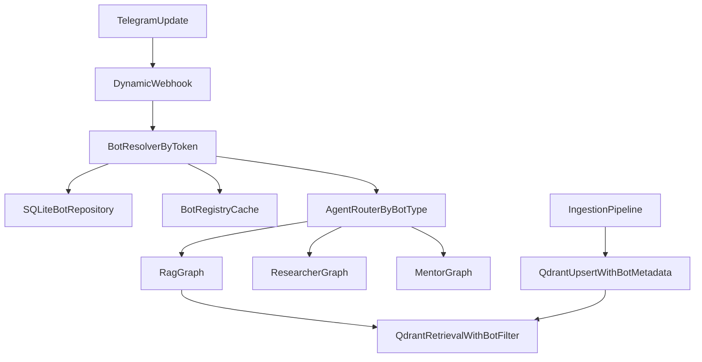

# tgrag_bot Swarm Implementation Plan

## Mission
Transform `tgrag_bot` from a single-bot webhook service into a self-hosted multi-bot platform ("Personal Bot Swarm") where:
- One admin bot provisions managed Telegram bots.
- All bots are served by one FastAPI backend.
- Data isolation is guaranteed per bot in Qdrant via strict metadata filtering.
- Agent behavior is routed by `bot_type` through LangGraph.

## Engineering Rules
- Async-first only (`async/await` end-to-end).
- Typed contracts everywhere (Pydantic + typed SQLAlchemy models).
- No blocking I/O in request path.
- Dependencies are managed with `uv` only.
- Backward-compatible rollout with feature flags.

## Current Baseline (Observed in Repository)
- Single webhook endpoint: `POST /webhook/telegram` in `apps/bot/main.py`.
- One aiogram bot instance initialized in FastAPI lifespan.
- Document metadata currently stored in JSON (`apps/bot/documents/store.py`).
- Qdrant config/status APIs exist (`apps/bot/qdrant/*`, `apps/bot/routes/qdrant.py`, `apps/bot/routes/settings_api.py`).
- Search and indexing are still stubs (`apps/bot/routes/search.py`, `apps/bot/routes/documents.py`).
- No SQLAlchemy models/migrations yet.
- No LangGraph runtime modules yet.

## Target Architecture

## Implementation Phases

### Phase 1 - SQLite Data Layer
**Goal:** Introduce durable bot/document state.

Deliverables:
- Add async DB infrastructure:
  - `apps/bot/db/base.py`
  - `apps/bot/db/engine.py`
  - `apps/bot/db/models.py`
  - `apps/bot/db/repositories/*`
- Add schema:
  - `bots(id, token, owner_id, name, bot_type, created_at)`
  - `documents(id, bot_id, filename, status, created_at)`
- Add enum types:
  - `BotType`: `rag | researcher | mentor`
  - `DocumentStatus`: `queued | processing | ready | failed`
- Add Alembic migrations.
- Temporary dual-write for documents (JSON + SQLite), then remove JSON writes.

Acceptance:
- Bot and document records survive restarts.
- Unique token constraint works.
- Existing app still starts and serves legacy endpoints.

### Phase 2 - Admin Bot Managed-Bot Provisioning
**Goal:** Provision child bots from Telegram admin UX.

Deliverables:
- Add admin-focused handlers:
  - `apps/bot/tg/handlers/admin.py`
  - `apps/bot/tg/handlers/common.py`
- Add `KeyboardButtonRequestManagedBot` in admin menu.
- Handle `managed_bot_created`.
- Fetch token with `get_managed_bot_token`.
- Persist bot record in SQLite.
- Register webhook: `/webhook/telegram/{bot_token}`.
- Enforce admin-only access using `ALLOWED_USER_IDS`.

Acceptance:
- Managed bot creation from Telegram works end-to-end.
- New bot appears in DB with correct metadata.
- Webhook registration succeeds and is logged.

### Phase 3 - Dynamic Webhook Routing
**Goal:** Route any Telegram update by bot token.

Deliverables:
- Add dynamic endpoint:
  - `apps/bot/routes/webhook.py` with `POST /webhook/telegram/{bot_token}`
- Add bot resolver and validation against DB token.
- Add `apps/bot/tg/bot_registry.py`:
  - lazy `aiogram.Bot` initialization
  - token-based cache
  - async lock protection
  - graceful session shutdown in lifespan
- Keep `/webhook/telegram` as temporary legacy fallback.

Acceptance:
- Unknown token requests are rejected safely.
- Known token updates are dispatched to the correct runtime bot instance.
- No regression for legacy webhook path during transition.

### Phase 4 - Agent Factory and Router (LangGraph)
**Goal:** Select execution graph by bot type.

Deliverables:
- Add agents package:
  - `apps/bot/agents/base.py`
  - `apps/bot/agents/router.py`
  - `apps/bot/agents/rag_graph.py`
  - `apps/bot/agents/researcher_graph.py`
  - `apps/bot/agents/mentor_graph.py`
- Add typed graph I/O models (`AgentInput`, `AgentOutput`).
- Add compiled graph cache per `bot_type`.
- Route every update through `bot_type` lookup from DB.

Acceptance:
- Three bot types can run distinct behavior paths.
- Graph compilation is not repeated on every request.

### Phase 5 - LlamaIndex Ingestion + Multi-tenant Qdrant
**Goal:** Replace stubs with real RAG and strict tenant isolation.

Deliverables:
- Add ingestion module:
  - `apps/bot/rag/ingestion.py`
- Parse and chunk uploaded files with LlamaIndex.
- Embed and upsert to Qdrant with payload metadata:
  - `bot_id` (mandatory)
  - `doc_id`
  - source metadata
- Enforce retrieval filter:
  - every search/query must include `bot_id == current_bot_id`
- Refactor endpoints:
  - `apps/bot/routes/documents.py` to DB-driven statuses
  - `apps/bot/routes/search.py` to real retrieval

Acceptance:
- Bot A cannot retrieve Bot B vectors.
- Documents move through `queued -> processing -> ready/failed`.
- Search returns real scored chunks from Qdrant.

### Phase 6 - Reliability, Testing, and Rollout
**Goal:** Ship safely and remove legacy paths.

Deliverables:
- Feature flags:
  - `ENABLE_MULTI_BOT`
  - `ENABLE_LANGGRAPH_ROUTER`
  - `ENABLE_QDRANT_MULTI_TENANT`
- Integration tests:
  - dynamic webhook routing
  - managed-bot provisioning flow
  - tenant isolation in retrieval
- Structured logs with `request_id`, `bot_id`, `update_id`.
- Remove legacy JSON store and static webhook path after stable burn-in.

Acceptance:
- Rollout can be staged and rolled back by flags.
- Regression risk is covered by integration tests.

## Risk Register and Mitigations
- **Cross-tenant leakage risk:** centralize filter construction and reject retrieval calls without `bot_id`.
- **Token lifecycle risk:** unique DB constraint + transactional insert + retry strategy.
- **Cold-start latency risk:** BotRegistry cache and warmup for active bots.
- **Migration risk:** temporary dual-write and read fallback before final cutover.

## Definition of Done
- Admin bot can create managed bots and store them in SQLite.
- Dynamic webhook path (`/webhook/telegram/{bot_token}`) is the main ingress.
- Router dispatches by `bot_type` to corresponding LangGraph.
- Qdrant writes/reads are strictly isolated by `bot_id`.
- Integration test proves bot data isolation (bot A cannot see bot B documents).

## Suggested Execution Order (Practical)
1. Phase 1 (DB + migrations)
2. Phase 2 (admin provisioning flow)
3. Phase 3 (dynamic webhooks + bot registry)
4. Phase 4 (agent router + graph skeletons)
5. Phase 5 (real ingestion/retrieval)
6. Phase 6 (test hardening + legacy removal)
