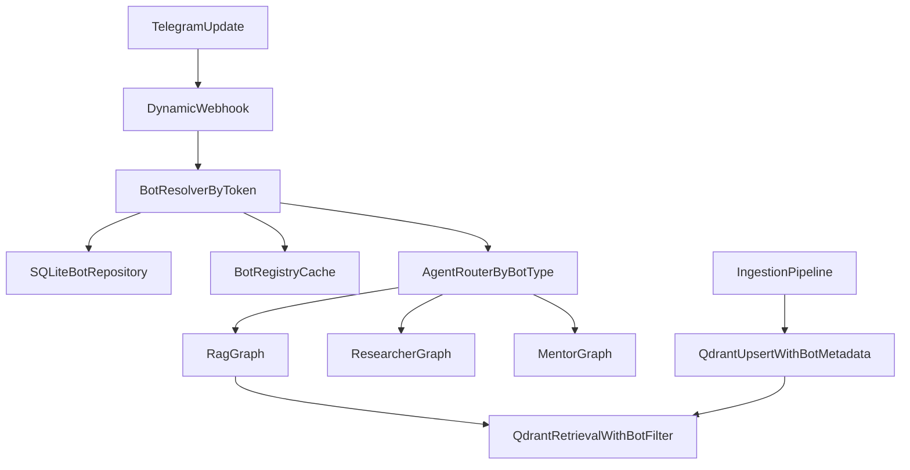

# tgrag_bot Swarm Implementation Plan

## Mission
Transform `tgrag_bot` from a single-bot webhook service into a self-hosted multi-bot platform ("Personal Bot Swarm") where:
- One admin bot provisions managed Telegram bots.
- All bots are served by one FastAPI backend.
- Data isolation is guaranteed per bot in Qdrant via strict metadata filtering.
- Agent behavior is routed by `bot_type` through LangGraph.

## Engineering Rules
- Async-first only (`async/await` end-to-end).
- Typed contracts everywhere (Pydantic + typed SQLAlchemy models).
- No blocking I/O in request path.
- Dependencies are managed with `uv` only.
- Backward-compatible rollout with feature flags.

## Current Baseline (Observed in Repository)
- Async SQLite data layer live: `apps/bot/db/{base,engine,models,repositories}` with `Bot`/`Document` ORM + enums (`BotType`, `DocumentStatus`). Tables bootstrapped on startup via `create_all` (Alembic pending). `GET/POST /api/bots` expose the bot registry.
- Dynamic webhook routing live: `POST /webhook/telegram/{bot_token}` resolves the bot via `BotsRepository.get_by_token` and dispatches through a token-addressed `BotRegistry` (`apps/bot/tg/bot_registry.py`) that lazily caches `aiogram.Bot` sessions with async-lock and closes them on shutdown. Legacy `POST /webhook/telegram` kept as fallback.
- Phase 2 admin UX live: reply keyboard with `KeyboardButtonRequestManagedBot` (Bot API 9.6), handler for `Message.managed_bot_created` that calls `get_managed_bot_token`, persists the bot, and auto-registers its per-token webhook. Admin scope enforced via `ALLOWED_USER_IDS`. Handlers reorganized into package `apps/bot/tg/handlers/{__init__,common,admin,user}`.
- aiogram bumped to `>=3.27.0` (Bot API 9.6 types).
- Document metadata still stored in JSON (`apps/bot/documents/store.py`) — dual-write with SQLite TBD.
- Qdrant config/status APIs exist (`apps/bot/qdrant/*`, `apps/bot/routes/qdrant.py`, `apps/bot/routes/settings_api.py`).
- Search and indexing are still stubs (`apps/bot/routes/search.py`, `apps/bot/routes/documents.py`).
- Alembic migrations not yet wired.
- No LangGraph runtime modules yet.

## Target Architecture

## Implementation Phases

### Phase 1 - SQLite Data Layer  ✅ (core done, Alembic + document dual-write pending)
**Goal:** Introduce durable bot/document state.

Deliverables:
- [x] Add async DB infrastructure:
  - `apps/bot/db/base.py`
  - `apps/bot/db/engine.py`
  - `apps/bot/db/models.py`
  - `apps/bot/db/repositories/bots.py`
- [x] Add schema:
  - `bots(id, token UNIQUE, owner_id, name, bot_type, created_at)`
  - `documents(id, bot_id FK CASCADE, filename, status, created_at)`
- [x] Add enum types:
  - `BotType`: `rag | researcher | mentor`
  - `DocumentStatus`: `queued | processing | ready | failed`
- [x] Expose `GET /api/bots`, `POST /api/bots` (admin seed + list).
- [ ] Add Alembic migrations (currently `Base.metadata.create_all` on startup).
- [ ] Add `DocumentsRepository` + temporary dual-write (JSON + SQLite), then remove JSON writes.

Acceptance:
- [x] Bot records survive restarts (SQLite file at `DATABASE_URL`, default `data/app.db`).
- [x] Unique token constraint enforced (409 on duplicate via `/api/bots`).
- [x] Existing app still starts and serves legacy endpoints.

### Phase 2 - Admin Bot Managed-Bot Provisioning  ✅
**Goal:** Provision child bots from Telegram admin UX using Bot API 9.6.

Deliverables:
- [x] Reorganise handlers into a package:
  - `apps/bot/tg/handlers/__init__.py` (aggregate router: admin before user)
  - `apps/bot/tg/handlers/common.py` (`is_admin`, `deny_if_not_admin`, `public_base_url`, `register_webhook_for_token`)
  - `apps/bot/tg/handlers/admin.py`
  - `apps/bot/tg/handlers/user.py` (migrated /start, /menu, catch-all)
- [x] Bump `aiogram>=3.27.0` (Bot API 9.6 types).
- [x] Admin `/start` shows a reply keyboard with `KeyboardButtonRequestManagedBot` (prereq: manager bot enabled in @BotFather's "Manage Bots" Mini App).
- [x] Handle `Message.managed_bot_created` (note: aiogram exposes the field as `mbc.bot_user` — alias of the `bot` JSON field).
- [x] Fetch token via `bot.get_managed_bot_token(user_id=new_bot.id)`.
- [x] Persist bot record in SQLite with default `bot_type=rag`.
- [x] Register webhook `{public_base}/webhook/telegram/{new_token}` via the shared `BotRegistry` (session stays cached).
- [x] Inline keyboard to switch `bot_type` post-creation (`set_type:<bot_id>:<type>`).
- [x] `/listbots` for admins.
- [x] Enforce admin-only access via `ALLOWED_USER_IDS` with a reusable `AdminFilter`.

Acceptance:
- [x] Non-admin `managed_bot_created` payloads are ignored (verified by smoke test).
- [x] New bot appears in DB with correct metadata (id, name, token, owner, type).
- [x] Webhook registration outcome is logged (`webhook_ok=true|false`) and surfaced in the admin reply.

### Phase 3 - Dynamic Webhook Routing  ✅
**Goal:** Route any Telegram update by bot token.

Deliverables:
- [x] Add dynamic endpoint: `apps/bot/routes/webhook.py` with `POST /webhook/telegram/{bot_token}`.
- [x] Add bot resolver and validation against DB token (404 on unknown, 400 on bad JSON, 503 if dispatcher missing, 500 on dispatch failure).
- [x] Add `apps/bot/tg/bot_registry.py`:
  - lazy `aiogram.Bot` initialization
  - token-based cache (with `evict(token)` for future rotation)
  - async lock protection (double-checked locking)
  - graceful `shutdown_all()` in FastAPI lifespan
- [x] Keep `/webhook/telegram` as temporary legacy fallback.
- [x] Structured logs per update: `bot_id`, `bot_type`, `update_id`.

Acceptance:
- [x] Unknown token requests are rejected safely (`404 Unknown bot token`).
- [x] Known token updates are dispatched to the correct runtime bot instance (verified with TestClient + handler hit assertion).
- [x] Cache reuse verified (`registry size` stays at 1 across multiple requests for the same token).
- [x] No regression for legacy webhook path during transition.

### Phase 4 - Agent Factory and Router (LangGraph)
**Goal:** Select execution graph by bot type.

Deliverables:
- Add agents package:
  - `apps/bot/agents/base.py`
  - `apps/bot/agents/router.py`
  - `apps/bot/agents/rag_graph.py`
  - `apps/bot/agents/researcher_graph.py`
  - `apps/bot/agents/mentor_graph.py`
- Add typed graph I/O models (`AgentInput`, `AgentOutput`).
- Add compiled graph cache per `bot_type`.
- Route every update through `bot_type` lookup from DB.

Acceptance:
- Three bot types can run distinct behavior paths.
- Graph compilation is not repeated on every request.

### Phase 5 - LlamaIndex Ingestion + Multi-tenant Qdrant
**Goal:** Replace stubs with real RAG and strict tenant isolation.

Deliverables:
- Add ingestion module:
  - `apps/bot/rag/ingestion.py`
- Parse and chunk uploaded files with LlamaIndex.
- Embed and upsert to Qdrant with payload metadata:
  - `bot_id` (mandatory)
  - `doc_id`
  - source metadata
- Enforce retrieval filter:
  - every search/query must include `bot_id == current_bot_id`
- Refactor endpoints:
  - `apps/bot/routes/documents.py` to DB-driven statuses
  - `apps/bot/routes/search.py` to real retrieval

Acceptance:
- Bot A cannot retrieve Bot B vectors.
- Documents move through `queued -> processing -> ready/failed`.
- Search returns real scored chunks from Qdrant.

### Phase 6 - Reliability, Testing, and Rollout
**Goal:** Ship safely and remove legacy paths.

Deliverables:
- Feature flags:
  - `ENABLE_MULTI_BOT`
  - `ENABLE_LANGGRAPH_ROUTER`
  - `ENABLE_QDRANT_MULTI_TENANT`
- Integration tests:
  - dynamic webhook routing
  - managed-bot provisioning flow
  - tenant isolation in retrieval
- Structured logs with `request_id`, `bot_id`, `update_id`.
- Remove legacy JSON store and static webhook path after stable burn-in.

Acceptance:
- Rollout can be staged and rolled back by flags.
- Regression risk is covered by integration tests.

## Risk Register and Mitigations
- **Cross-tenant leakage risk:** centralize filter construction and reject retrieval calls without `bot_id`.
- **Token lifecycle risk:** unique DB constraint + transactional insert + retry strategy.
- **Cold-start latency risk:** BotRegistry cache and warmup for active bots.
- **Migration risk:** temporary dual-write and read fallback before final cutover.

## Definition of Done
- Admin bot can create managed bots and store them in SQLite.
- Dynamic webhook path (`/webhook/telegram/{bot_token}`) is the main ingress.
- Router dispatches by `bot_type` to corresponding LangGraph.
- Qdrant writes/reads are strictly isolated by `bot_id`.
- Integration test proves bot data isolation (bot A cannot see bot B documents).

## Suggested Execution Order (Practical)
1. ✅ Phase 1 — DB + `/api/bots` (Alembic + documents repo still pending)
2. ✅ Phase 3 — dynamic webhooks + BotRegistry (executed before Phase 2 because Phase 2 depends on this endpoint existing)
3. ✅ Phase 2 — admin provisioning via Bot API 9.6 (`KeyboardButtonRequestManagedBot` + `managed_bot_created` + `get_managed_bot_token`)
4. ⏭ Alembic baseline + `DocumentsRepository` (close Phase 1)
5. ⏭ Phase 4 (agent router + graph skeletons, `bot_type`-driven)
6. ⏭ Phase 5 (real ingestion/retrieval with strict `bot_id` tenant filter)
7. ⏭ Phase 6 (test hardening + legacy removal)

## Known Gaps / Follow-ups
- Telegram webhook secret (`X-Telegram-Bot-Api-Secret-Token`) not enforced — easy win for Phase 6.
- `allowed_updates` not configured on `set_webhook`; default excludes `managed_bot` top-level update (we use `Message.managed_bot_created` which is in default scope, so OK for now).
- Startup re-registration of existing bots' webhooks after public-base URL change (pinggy-style dev tunnels) not implemented.
- `/api/bots` is currently open (no auth); add admin header/token before exposing publicly.
